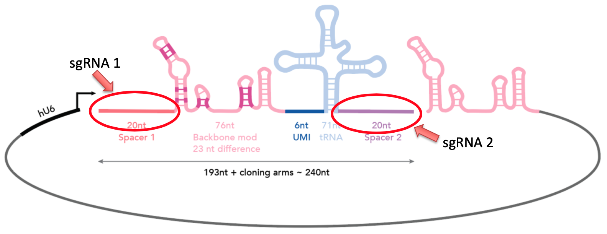
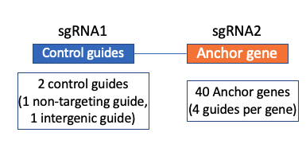
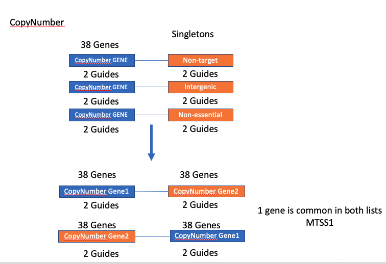
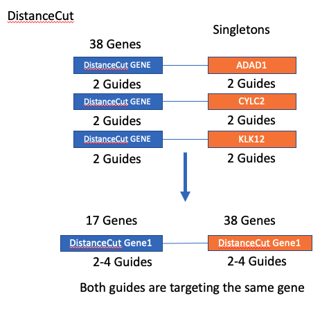
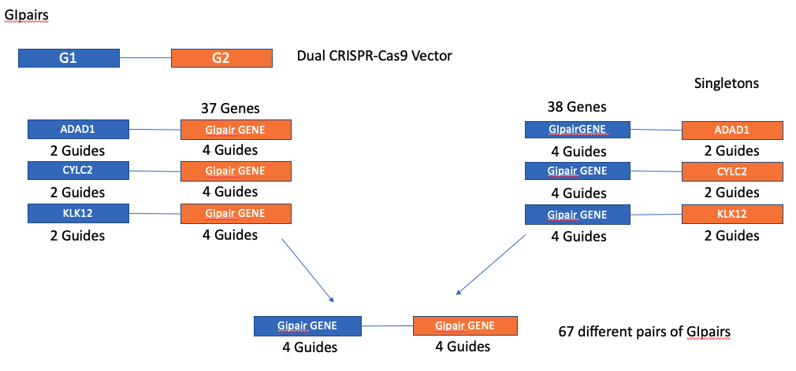
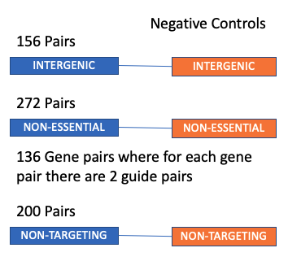
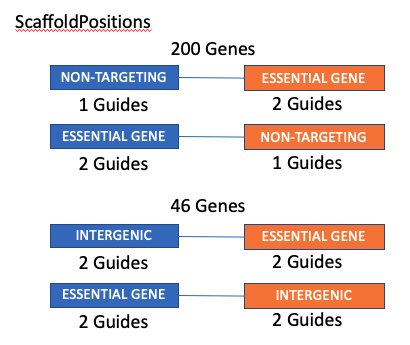

## DUAL CRISPR-Cas9 KO LIBRARIES

Dual CRISPR-Cas9 KO Libraries are similar to the Single CRISPR-Cas9 Libraries in terms of their design. The main difference is that instead of a single guide RNA, each vector contains 2 guideRNAs as a pair targeting different genes or in some cases the same gene. 

The vector structure for the library is as follows: 

Each vector can be represented as follows: 
<ul>
<li> Pair of guide RNAs (<em>sgRNA1, sgRNA2</em>). Here each guide is targeting a different region of the genome. It can be a gene, intergenic region or non-targeting. </li>
<li>Scaffolds: The scaffold sequence in the vector. There are 3 different versions of scaffold: 
<ul>
<li> Wildtype </li>
<li> Modified6 </li>
<li> Modified7 </li>
</ul>
</li>
</ul>

The libraries that we are documenting here are as follows:
<ul>
<li> PILOT Library (A small library first designed to test the dual CRISPR-Cas9 KO Screens and optimize the results)</li>
<li>Colorectal Library1 (COLO1) : developed for the KRAS mutant colon cancers. </li>

Although there are slight differences between different libraries the main format of the libraries are as follows: 

| ID          | Notes1           | Notes2                | sgRNA1_WGE_ID | sgRNA1_WGE_Sequence     | sgRNA1_Library | sgRNA1_Approved_Symbol | sgRNA1_Off_Target               | sgRNA1_Chr | sgRNA1_Start | sgRNA1_End | sgRNA1_Strand | sgRNA1_Confidence | sgRNA2_WGE_ID | sgRNA2_WGE_Sequence     | sgRNA2_Library | sgRNA2_Approved_Symbol | sgRNA2_Off_Target                  | sgRNA2_Chr | sgRNA2_Start | sgRNA2_End | sgRNA2_Strand | sgRNA2_Confidence | Scaffold                                                                     | Linker | tRNA                                                                    | Oligo_Sequence                                                                                                                                                                                                                                       |
| ----------- | ---------------- | --------------------- | ------------- | ----------------------- | -------------- | ---------------------- | ------------------------------- | ---------- | ------------ | ---------- | ------------- | ----------------- | ------------- | ----------------------- | -------------- | ---------------------- | ---------------------------------- | ---------- | ------------ | ---------- | ------------- | ----------------- | ---------------------------------------------------------------------------- | ------ | ----------------------------------------------------------------------- | ---------------------------------------------------------------------------------------------------------------------------------------------------------------------------------------------------------------------------------------------------- |
| GI000000001 | AnchorSingletons | AnchorSingletons_Pos2 | 979584041       | GCTAGTTCAGATAAAACAACAGG | KosukeYusa     | ADAD1                  | {0: 1, 1: 0, 2: 0, 3: 9, 4: 93} | 4          | 122393612     | 122393634   | \-            | Control           | 1162351773      | GGAGGGAGTCCTCTGTGAAGCGG | KosukeYusa     | DNMT1                  | {0: 1, 1: 0, 2: 29, 3: 52, 4: 277} | 19         | 10154719     | 10154741   | +             | Green             | GTTTCAGAGCTAGAAATAGCAAGTTGAAATAAGACTAGTTCGTTATCACGCCGAAAGGCGGGCACCGAGTCGGTGC | GCAGAG | GCATTGGTGGTTCAGTGGTAGAATTCTCGCCTCCCACGCGGGAGACCCGGGTTCAATTCCCGGCCAATGCA | ATCTTGTGGAAAGGACGAAACACCGCTAGTTCAGATAAAACAACGTTTCAGAGCTAGAAATAGCAAGTTGAAATAAGACTAGTTCGTTATCACGCCGAAAGGCGGGCACCGAGTCGGTGCGCAGAGGCATTGGTGGTTCAGTGGTAGAATTCTCGCCTCCCACGCGGGAGACCCGGGTTCAATTCCCGGCCAATGCAGGAGGGAGTCCTCTGTGAAGGTTTAAGAGCTATGCTGGAAACAGCAT |
| GI000000002 | AnchorSingletons | AnchorSingletons_Pos2 | 979584041       | GCTAGTTCAGATAAAACAACAGG | KosukeYusa     | ADAD1                  | {0: 1, 1: 0, 2: 0, 3: 9, 4: 93} | 4          | 122393612     | 122393634   | \-            | Control           | 1162352611      | GCTGTACGTACCGCGTCTGGTGG | KosukeYusa     | DNMT1                  | {0: 1, 1: 0, 2: 0, 3: 0, 4: 9}     | 19         | 10159831     | 10159853   | +             | Green             | GTTTCAGAGCTAGAAATAGCAAGTTGAAATAAGACTAGTTCGTTATCACGCCGAAAGGCGGGCACCGAGTCGGTGC | GCAGAG | GCATTGGTGGTTCAGTGGTAGAATTCTCGCCTCCCACGCGGGAGACCCGGGTTCAATTCCCGGCCAATGCA | ATCTTGTGGAAAGGACGAAACACCGCTAGTTCAGATAAAACAACGTTTCAGAGCTAGAAATAGCAAGTTGAAATAAGACTAGTTCGTTATCACGCCGAAAGGCGGGCACCGAGTCGGTGCGCAGAGGCATTGGTGGTTCAGTGGTAGAATTCTCGCCTCCCACGCGGGAGACCCGGGTTCAATTCCCGGCCAATGCAGCTGTACGTACCGCGTCTGGGTTTAAGAGCTATGCTGGAAACAGCAT |

The fields that are in the library are as follows: 
<ul> <li> <strong>ID</strong> : The unquie identifier for the vector </li>
<li> <strong>Notes1, Notes2 or Notes</strong>: These are the annotations of the pairs in the library. Most of the libraries have Notes1 and Notes2 but the Pilot library contains only Notes</li>
<li><strong>Scaffold</strong>: This is a field that is in the PILOT Library and it is not in the COLO and BRCA Libraries. The scaffold is selected from one of these three options:
<ul><li><em>Wildtype</em>: The wildtype scaffold.</li>
<li><em>Modified6</em>: modified sgRNA-scaffold sequence for reducing the recombination (T>C substitution in Lower Stem) </li>
<li><em>Modified7</em>: modified sgRNA-scaffold sequence for reducing the recombination -   (T>C substitution in Lower Stem plus additional substitutions in Nexus and Hairpin) </li>
</ul>
<li><strong>sgRNA1_WGE_ID</strong>: The unique identifier for the first guide in the vector</li>
<li><strong>sgRNA1_WGE_Sequence</strong>: The sequence of the first guide RNA that is targeting a region in the genome. If the sequence is targeting a region in the genome (gene or intergenic) the size of the sequence is 23bp. The last 3bps are NGG and the first symbol is a G. The guide that is corresponding to the region in the genome uniquely is the 19bps that is starting with the 2nd position of the sequence and ending at the 20th position (inclusive both). If the guide is not targeting a region in the genome   (non-targeting guide), the length of the sequence is 19bps. </li> 
<li><strong>sgRNA1_Library</strong>: Which library the guide is coming from. We aim to choose KosukeYusa first but if it is not possible we choose from other libraries</li> 
<li><strong>sgRNA1_Approved_Symbol</strong>: the gene name that is targeted by the first guide. The gene name is in HGNC human readable format. If the guide is not targeting a gene (intergenic or non-targeting), the gene name is blank.</li> 
<li><strong>sgRNA1_Off_Target</strong>: The off-target effects of the first guide.</li> 
<li><strong>sgRNA1_Chr</strong>: The chromosome that is targeted by the first guide. If the guide is a non-targeting guide, the chromosome field in blank.</li> 
<li><strong>sgRNA1_Start</strong>: The starting position for the region on genome targeted by the first guide. If the guide is a non-targeting guide, the starting position is blank.</li> 
<li><strong>sgRNA1_End</strong>: The ending position for the region on genome targeted by the first guide. If the guide is a non-targeting guide, the end position is blank.</li> 
<li><strong>sgRNA1_Strand</strong>:The strand of the region on genome targeted by the first guide. If the guide is a non-targeting guide, strand is blank.</li> 
<li><strong>sgRNA1_Confidence</strong>: The confidence for the guide. The confidence can be one of these options:
<ul><li><em>Control</em>: The guide is a non-essential guide that is used for the singletons. </li>
<li><em>Green</em>: The guide is efficient and selected as a good guide that is cutting the targeted region efficiently with minimum amount of off-targets effects</li>
<li><em>Amber</em>: The guide is not passing all the criteria for a good guide but it is still usable.</li>
<li><em>Red</em>: The guide is not an ideal guide.All the guides that are targeting this gene must be inefficient or must have many off-target regions. However we need to choose a guide for the gene and this guide is selected.</li>
<li><em>Blank<em>: If the guide is non-targeting guide than this field is not possible to estimate so it is left blank.</li>
</li> 
<li><strong>sgRNA2_WGE_ID, sgRNA2_WGE_Sequence, sgRNA2_Library, sgRNA2_Approved_Symbol, sgRNA2_Off_Target, sgRNA2_Chr, sgRNA2_Start, sgRNA2_End, sgRNA2_Strand, sgRNA2_Confidence</strong>: These are the fields for the second guide. The second guide columns have the same descriptions as the previous fields that are described above for the first guide</li> 
<li><strong>Scaffold</strong>: The sequence of the scaffold</li> 
<li><strong>Linker</strong>: Linker sequence</li> 
<li><strong>tRNA</strong>: tRNA sequence</li> 
<li><strong>Oligo_Sequence</strong>: The combination of the guide sequences, scaffolds, tRNA and linker. This is the final sequence of the vector that is used for ordering the library</li>
</ul>

The details of each library are as follows:

### 1 PILOT LIBRARY:

There are 8914 Vectors in the library.  This the library that is designed for testing and optimising the dual CRISPR-Cas9 KO Screens and it contains a small test vectors with different scaffolds. 

The library contains the Notes field and the an extra Scaffold field compared to the other libraries. The remaining fields are the same. The annotations of the vectors that are in the Notes field is as follows: 
#### <strong>Anchors</strong>: 
320 total vectors are annotated as Anchors. There are 40 genes selected as Anchors. These are Anchor singletons. <strong>Singletons</strong> are vectors where one guide is targeting a region of genome we are interested in and the other guide is a <strong>control guide</strong> A control guide is a guide that is targeting a region of the genome that we know has no effect on the fitness of the cell lines we are using. Control guides are also selected from the regions of the genome with minimum copy number variation. You can see more information about it in the Library Design Section. 
Here the Anchor genes are located in the second guide position and the control guides are located in the first guide position. 

The 40 anchor genes are:
|      |      |      |      |      |      |      |      |
|------|------|------|------|------|------|------|----|
|AKT1  |ATR   |CDK4  |DNMT3B|KRAS  |MDM2  |PRMT1 |SRC |
|AKT2  |BCL2  |CDK6  |EGFR  |MAP2K1|MYC   |PRMT5 |TAZ |
|APC   |BCL2L1|CHEK1 |ERBB2 |MAP2K2|PARP1 |PTPN11|WEE1|
|ARID1A|BRAF  |CTNNB1|IGF1R |MAPK1 |PIK3CA|RAF1  |WRN |
|ATM   |BRD4  |DNMT1 |JAK1  |MCL1  |PORCN |SMAD4 |YAP1|
The control guides are selected as non-targeting and intergenic guides. For each anchor gene the same non-targeting and intergenic guide is paired for its 4 targeting guides. 
All the anchor singletons are using the wildtype scaffold.

#### <strong>CopyNumber</strong>:
This category contains a set of genes that are paired with each other and their singletons. (Please refer [Emmanuel Goncalves](mailto:emanuelvgoncalves@gmail.com)). 
The structure of the guides are as follows: 

There are 600 total guides in this category and all the vectors have the wildtype scaffold.

#### <strong>DistanceCut</strong>:
This is a special category for pairs of guides that are targeting the same genes with different guides. The category contains the both singleton and the pairings. The numbe of the guides are not consistent. Some genes have 4 guides and some have 2. 
The format of this annotation category is as follows:

There are 286 vectors in this category and all the vectors are using the wildtype scaffold. 

#### <strong>GIpairs</strong>:
This is the library combinations where anchor genes and the library genes are combined together. Notice that the anchor singletons here are different than the category Anchors. Here all the singletons are generated by pairing the genes against non-essential control genes (ADAD1, CYLC2 and KLK12) For each non-essential control gene there are 2 guides and a total of 6 guides. The structure of the GIpairs is as follows:

Notice that the position of the GIpair genes are the same in the singleton version. If the gene is in the first position than in the singleton version it is also in the first position. A total of 2872 vectors are in the GIpairs annotation. All the vectors are using the wildtype scaffold. 

#### <strong>NegControls</strong>:
These are the negative control guides in the Pilot library. They are consistent of 3 different types of pairings:
<ul><li>NON-ESSENTIAL, NON-ESSENTIAL pairings</li>
<li>INTERGENIC-INTERGENIC pairings</li>
<li>NON-TARGETING, NON-TARGETING pairings</li>
</ul>
All  of these pairings are between guides that are not effecting the fitness of the cell lines. Overall we are not expecting to see any change in the viability of the cells for these pairings. Note that there is a slight difference for the NON-TARGETING pairs, as they are not inducing any cuts on the genome. The structure of the negative controls in the library is as follows: 

There is a total of 628 guide pairings in the Negative Controls. in the Pilot library these pairs are duplicated 3 times with 3 possible scaffolds( Wildtype, Modified-6 and Modified-7). As a result we have 3X628=1884 total guides. Here different scaffolds are used to understand the effects of the scaffolds on the recombination rate. 

#### <strong>ScaffoldPosition</strong>:
This annotation corresponds to the positive control guides. Here essential genes are paired with non-targeting regions as well as intergenic regions. The main fitness effect is coming from the essential genes so we need to observe a reduction at the fitness of the cells. This guides are designed in bot positions, meaning all the vectors have their flipped positions in the ScaffoldPosition category. The structure of the guide pairs are as follows: 

There are a total of 984 guide pairs. Each of these pairs are duplicated 3 times with 3 possible scaffolds( Wildtype, Modified-6 and Modified-7). As a result we have 3X984=2952 total guides.

Information related to the Pilot library can be found in [EMRE] 

#### COLO1 Library:
There are total of 100136 Vectors in the library and all the vectors are designed using Wildtype Scaffold. As we described above this is an anchored library where a set of 40 anchor genes are paired with 404 library genes. The annotation categories for the COLO1 library is under the (Notes) field and can be described as follows: 
<ul>
<li><strong>AnchorSingletons</strong>: The Anchor Singletons are corresponding to the guides that are targeting 40 Anchor genes and they are paired with non-essential control genes for COLO (ADAD1,CYLC2 and KLK12). Each anchor gene has 4 guides targeting it and each non-essential control gene has 2 guides targeting it. For each anchor gene there are 4*6=24 guides. For 40 guides we have 40*24 = 960 guides. Notice that the guide that is targeting the anchor gene is always in the position 2 on the vector and the guide that is targeting the non-essential genes are in the position 1. Anchor Singletons are used for estimating the effect of the anchor genes on the fitness of the cell lines. </li>
<li><strong>LibrarySingletons</strong>: The Library singletons are corresponding to the guides that are targeting 404 library genes and they are paired with non-essential control genes for COLO (ADAD1,CYLC2 and KLK12). Each library gene has 2 guides targeting it and each non-essential control gene has 2 guides targeting it. For each library gene there are 2*6=12 guides. For 404 genes we have 404*12= 4848 guides. Notice that the guide that is targeting the library gene is always in the position 1 on the vector and the guide that is targeting the non-essential genes are in the position 2. Library Singletons are used for estimating the effect of the library genes on the fitness of the cell lines. </li>
<li><strong>LibraryCombinations</strong>: The library combinations are the guide pairings where the guide at the first position is targeting a library gene and the guide in the second position is targeting an anchor gene. Here we are using the same 2 guides that we used for the library genes in the LibrarySingletons. However for the anchor genes we are using a subset of 2 guides from the 4 guides that we designed in the AnchorSingletons. For each gene pairing we have 2*2=4 guide pairs. For the (library, anchor) combinations we have 40*404= 16160 combinations.  For all the combinations we have 16160*4=64640 guides. This is the bulk of the library and they correspond to the combinations we want to test in this library. </li>  

